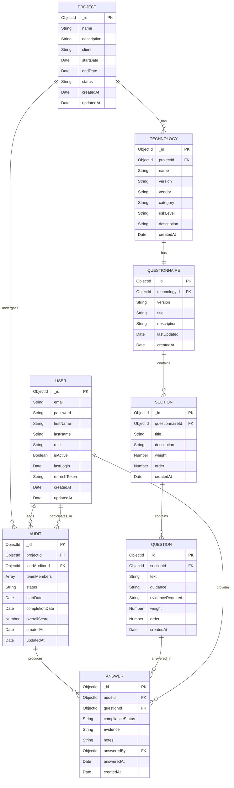

# 🏗️ Tech Audit Management System - Entity Relationship Diagram

## 📊 **Complete Entity Relationship Diagram**



## 🔗 **Relationship Details**

### **1. PROJECT → TECHNOLOGY (1:N)**
- **One project** can have **multiple technologies**
- **Each technology** belongs to **exactly one project**
- **Relationship**: `PROJECT.projectId` → `TECHNOLOGY.projectId`

### **2. TECHNOLOGY → QUESTIONNAIRE (1:1)**
- **One technology** has **exactly one questionnaire**
- **Each questionnaire** belongs to **exactly one technology**
- **Relationship**: `TECHNOLOGY._id` → `QUESTIONNAIRE.technologyId`

### **3. QUESTIONNAIRE → SECTION (1:N)**
- **One questionnaire** can have **multiple sections**
- **Each section** belongs to **exactly one questionnaire**
- **Relationship**: `QUESTIONNAIRE._id` → `SECTION.questionnaireId`

### **4. SECTION → QUESTION (1:N)**
- **One section** can have **multiple questions**
- **Each question** belongs to **exactly one section**
- **Relationship**: `SECTION._id` → `QUESTION.sectionId`

### **5. PROJECT → AUDIT (1:N)**
- **One project** can have **multiple audits** (over time)
- **Each audit** belongs to **exactly one project**
- **Relationship**: `PROJECT._id` → `AUDIT.projectId`

### **6. AUDIT → ANSWER (1:N)**
- **One audit** produces **multiple answers**
- **Each answer** belongs to **exactly one audit**
- **Relationship**: `AUDIT._id` → `ANSWER.auditId`

### **7. QUESTION → ANSWER (1:N)**
- **One question** can have **multiple answers** (from different audits)
- **Each answer** corresponds to **exactly one question**
- **Relationship**: `QUESTION._id` → `ANSWER.questionId`

### **8. USER → AUDIT (1:N)**
- **One user** can lead **multiple audits**
- **One user** can participate in **multiple audits** as team member
- **Each audit** has **exactly one lead auditor**
- **Relationship**: `USER._id` → `AUDIT.leadAuditorId` (lead)
- **Relationship**: `USER._id` → `AUDIT.teamMembers[]` (participant)

### **9. USER → ANSWER (1:N)**
- **One user** can provide **multiple answers**
- **Each answer** is provided by **exactly one user**
- **Relationship**: `USER._id` → `ANSWER.answeredBy`

## 📋 **Key Business Rules**

### **Audit Workflow**
1. **Project** is created with **Technologies**
2. **Technologies** have **Questionnaires** with **Sections** and **Questions**
3. **Audit** is created for a **Project**
4. **Auditors** answer **Questions** producing **Answers**
5. **Compliance scores** are calculated based on **Answers**

### **Compliance Scoring**
- **Compliant**: 2 points
- **Partially Compliant**: 1 point  
- **Non-Compliant**: 0 points
- **Weighted scoring** based on question and section weights

### **Access Control**
- **Admin**: Full access to all entities
- **Lead Auditor**: Can manage assigned audit and view project data
- **Team Auditor**: Can answer questions and view assigned sections
- **Viewer**: Read-only access to completed audits

## 🎯 **Data Flow Example**

```
1. Create PROJECT "Banking System Audit"
2. Add TECHNOLOGY "Oracle Database 19c" to project
3. Create QUESTIONNAIRE for Oracle Database
4. Add SECTIONS: "Security", "Performance", "Compliance"
5. Add QUESTIONS to each section
6. Create AUDIT for the project
7. Assign AUDITORS to the audit
8. AUDITORS provide ANSWERS to questions
9. Calculate overall compliance score
10. Generate audit report
```

## 🔧 **Database Indexes (Recommended)**

```javascript
// Performance optimization indexes
PROJECT: { client: 1, status: 1, startDate: 1 }
TECHNOLOGY: { projectId: 1, category: 1, riskLevel: 1 }
QUESTIONNAIRE: { technologyId: 1 }
SECTION: { questionnaireId: 1, order: 1 }
QUESTION: { sectionId: 1, order: 1 }
AUDIT: { projectId: 1, status: 1, leadAuditorId: 1 }
ANSWER: { auditId: 1, questionId: 1, complianceStatus: 1 }
USER: { email: 1, role: 1, isActive: 1 }
```

## 📊 **Sample Data Structure**

### **Complete Audit Example**
```json
{
  "project": {
    "name": "E-commerce Platform Security Audit",
    "client": "TechCorp Inc",
    "startDate": "2024-01-15",
    "endDate": "2024-01-29"
  },
  "technologies": [
    {
      "name": "React.js",
      "version": "18.2.0",
      "vendor": "Meta",
      "category": "Frontend Framework",
      "riskLevel": "medium"
    }
  ],
  "questionnaire": {
    "sections": [
      {
        "title": "Authentication & Authorization",
        "weight": 30,
        "questions": [
          {
            "text": "Is JWT token expiration properly configured?",
            "weight": 10,
            "evidenceRequired": "Configuration files and token validation logic"
          }
        ]
      }
    ]
  },
  "audit": {
    "status": "in-progress",
    "leadAuditor": "john.doe@company.com",
    "teamMembers": ["jane.smith@company.com"],
    "startDate": "2024-01-15"
  }
}
```

---

**Note**: This diagram represents the complete data model for the Tech Audit Management System. All entities follow the Clean Architecture pattern and include proper validation, business logic, and relationship management.
